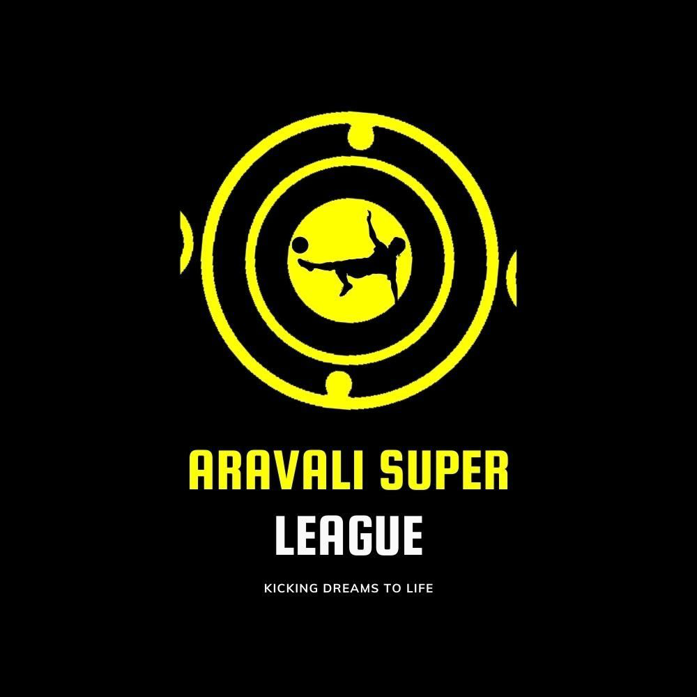

# ⚽ Football Management App

A comprehensive React Native mobile application for managing football tournaments, teams, players, and matches. Built with Expo and TypeScript, featuring real-time synchronization across multiple devices.



## 🚀 Features

### 🏆 Tournament Management
- Create and manage football tournaments
- Real-time standings and league tables
- Weekly match scheduling
- Tournament statistics and analytics

### 👥 Team Management
- Create teams with custom logos and colors
- Manage team rosters and player information
- Track team statistics (wins, draws, losses, goals)
- Captain and management role assignments

### 👤 Player Management
- Add players with photos and jersey numbers
- Position-based player organization (Goalkeeper, Defender, Midfielder, Forward)
- Player statistics tracking (goals, assists, cards)
- Squad selection for matches (7 main + 3 substitutes)

### ⚽ Match Management
- Schedule upcoming matches
- Live match scoring and event tracking
- Match events (goals, cards, substitutions, assists)
- Detailed match statistics and history

### 🔐 User Authentication
- Role-based access (Management, Captain, Spectator)
- Secure login and registration
- Social authentication support
- User profile management

### 📱 Real-time Synchronization
- Multi-device data synchronization
- Offline support with data persistence
- Real-time updates across all connected devices
- Connection status monitoring

## 🛠️ Tech Stack

- **Framework**: React Native with Expo
- **Language**: TypeScript
- **Navigation**: React Navigation v6
- **State Management**: React Context API
- **Storage**: AsyncStorage
- **UI Components**: Custom components with Expo Vector Icons
- **Image Handling**: Expo Image Picker
- **Date/Time**: Moment.js
- **Networking**: Fetch API with custom service layer

## 📋 Prerequisites

- Node.js (v16 or higher)
- npm or yarn
- Expo CLI
- iOS Simulator / Android Emulator or physical device
- Backend API server (see [Backend Integration](#backend-integration))

## 🚀 Installation

1. **Clone the repository**
   ```bash
   git clone https://github.com/vishal-04-singh/football-app-FD.git
   cd football-app-FD
   ```

2. **Install dependencies**
   ```bash
   npm install
   ```

3. **Configure API endpoint**
   ```typescript
   // services/api.ts
   const API_BASE_URL = 'http://your-backend-url:3000/api'
   ```

4. **Start the development server**
   ```bash
   npm start
   ```

5. **Run on device/emulator**
   ```bash
   # iOS
   npm run ios
   
   # Android
   npm run android
   
   # Web
   npm run web
   ```

## 📁 Project Structure

```
football-app-FD/
├── src/
│   ├── screens/          # App screens
│   │   ├── LoginScreen.tsx
│   │   ├── SignupScreen.tsx
│   │   ├── HomeScreen.tsx
│   │   ├── TeamsScreen.tsx
│   │   ├── MatchDetailScreen.tsx
│   │   └── ...
│   ├── types/            # TypeScript type definitions
│   │   └── index.ts
│   ├── constants/        # App constants
│   │   └── colors.ts
│   └── App.js           # Main app entry point
├── components/          # Reusable components
│   ├── MatchCard.tsx
│   ├── PositionPicker.tsx
│   ├── ConnectionStatus.tsx
│   └── ui/              # UI components
├── services/           # API services
│   └── api.ts
├── assets/            # Images and icons
├── app.json          # Expo configuration
└── package.json      # Dependencies
```

## 🎯 Key Components

### User Roles
- **Management**: Full access to create/edit teams, schedule matches, manage tournaments
- **Captain**: Team-specific management, player selection, match updates
- **Spectator**: View-only access to matches, standings, and statistics

### Data Models
- **User**: Authentication and role management
- **Team**: Team information, players, and statistics
- **Player**: Individual player data and performance stats
- **Match**: Match details, scores, and events
- **Tournament**: Overall tournament structure and settings

## 🔧 Configuration

### API Configuration
Update the API base URL in `services/api.ts`:

```typescript
const API_BASE_URL = __DEV__ 
  ? 'http://localhost:3000/api'          // Development
  : 'https://your-production-api.com/api' // Production
```

### For Physical Device Testing
Find your computer's IP address and update the API URL:

```bash
# macOS/Linux
ifconfig | grep "inet " | grep -v 127.0.0.1

# Windows
ipconfig | findstr "IPv4"

# Update API_BASE_URL
const API_BASE_URL = 'http://YOUR_IP_ADDRESS:3000/api'
```

## 🌐 Backend Integration

This app requires a backend API server. Key endpoints include:

- `POST /auth/login` - User authentication
- `GET /tournament` - Tournament data
- `POST /teams` - Create team
- `POST /players` - Add player
- `POST /matches` - Schedule match
- `PUT /matches/:id/events` - Update match events

For detailed backend integration guide, see [FRONTEND_BACKEND_INTEGRATION.md](./FRONTEND_BACKEND_INTEGRATION.md)

## 📱 Screenshots

*Add screenshots of your app here*

## 🔄 Real-time Features

- **Team Creation**: Instantly syncs across all devices
- **Match Updates**: Live score updates and event tracking
- **Player Management**: Real-time roster updates
- **Tournament Standings**: Auto-calculated points and rankings

## 🧪 Testing

```bash
# Run tests (if configured)
npm test

# Type checking
npx tsc --noEmit

# Linting
npx eslint . --ext .ts,.tsx
```

## 📦 Building for Production

```bash
# Build for production
expo build:android
expo build:ios

# Or using EAS Build
eas build --platform android
eas build --platform ios
```

## 🤝 Contributing

1. Fork the repository
2. Create a feature branch (`git checkout -b feature/AmazingFeature`)
3. Commit your changes (`git commit -m 'Add some AmazingFeature'`)
4. Push to the branch (`git push origin feature/AmazingFeature`)
5. Open a Pull Request

## 📄 License

This project is private and proprietary.

## 👨‍💻 Author

**Vishal Singh** - [@vishal-04-singh](https://github.com/vishal-04-singh)

## 🙏 Acknowledgments

- Expo team for the amazing development platform
- React Native community for continuous support
- All contributors and testers

## 📞 Support

For support and questions, please create an issue in this repository or contact the development team.

---

⚽ **Made with passion for football management** ⚽
